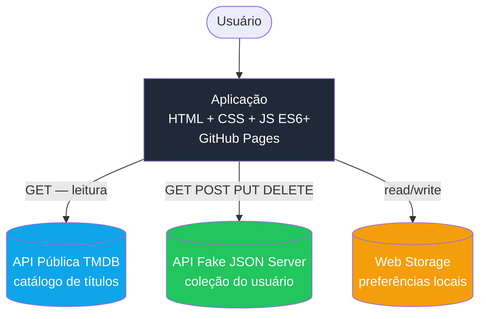
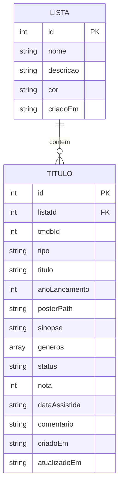

# Documento de Arquitetura — CineSI

**Software Design Document**

| Campo | Valor |
|---|---|
| Projeto | CineSI — catálogo pessoal de filmes e séries |
| Autor | Douglas Henrick |
| Disciplina | TSI32B — Desenvolvimento de Páginas Web com Framework e CSS |
| Versão | 1.0 |
| Data | 06/09/2026 |

---

## 1. Visão geral da arquitetura

A aplicação é inteiramente client-side. Não existe backend próprio: o navegador conversa diretamente com três fontes de dados, cada uma com um papel distinto.



**Divisão de responsabilidades**

| Fonte | Papel | Operações |
|---|---|---|
| TMDB | Catálogo público. Fonte da verdade sobre os títulos existentes no mundo. | Somente leitura |
| JSON Server | Coleção pessoal. Fonte da verdade sobre o que *este* usuário salvou. | Leitura e escrita |
| Web Storage | Preferências de interface. Nada que importe se for perdido. | Leitura e escrita |

Essa separação é deliberada: a TMDB não guarda nada do usuário e o JSON Server não duplica o catálogo, apenas referencia títulos pelo `tmdbId`.

## 2. Modelo de dados



### 2.1 Dicionário de dados — `titulo`

| Campo | Tipo | Obrigatório | Regras |
|---|---|---|---|
| `id` | integer | sim | Gerado pelo JSON Server |
| `listaId` | integer | sim | Referência a `lista.id` (RN06) |
| `tmdbId` | integer | sim | Identificador na TMDB. Único na coleção (RN01) |
| `tipo` | string | sim | `movie` ou `tv` |
| `titulo` | string | sim | 1 a 200 caracteres |
| `anoLancamento` | integer | não | Vindo da API |
| `posterPath` | string | não | Caminho relativo do pôster na TMDB |
| `sinopse` | string | não | Vinda da API |
| `generos` | array&lt;string&gt; | sim | Ao menos um elemento |
| `status` | string | sim | `quero_assistir` \| `assistindo` \| `concluido` (RN02) |
| `nota` | integer | condicional | 0 a 10. Só aceito quando `status = concluido` (RN03) |
| `dataAssistida` | string (ISO) | condicional | Obrigatória quando `status = concluido`. Não pode ser futura (RN04) |
| `comentario` | string | não | Máximo 280 caracteres (RN05) |
| `criadoEm` | string (ISO) | sim | Definido na criação |
| `atualizadoEm` | string (ISO) | sim | Atualizado a cada edição |

### 2.2 Dicionário de dados — `lista`

| Campo | Tipo | Obrigatório | Regras |
|---|---|---|---|
| `id` | integer | sim | Gerado pelo JSON Server |
| `nome` | string | sim | 1 a 50 caracteres, único |
| `descricao` | string | não | Máximo 140 caracteres |
| `cor` | string | não | Hexadecimal, usado no badge da interface |
| `criadoEm` | string (ISO) | sim | Definido na criação |

## 3. Contratos da API Fake (JSON Server)

**Base URL local:** `http://localhost:3000`

| Método | Endpoint | Descrição |
|---|---|---|
| `GET` | `/titulos` | Lista todos os títulos da coleção |
| `GET` | `/titulos?status=concluido` | Filtra por status |
| `GET` | `/titulos?listaId=1` | Filtra por lista |
| `GET` | `/titulos/:id` | Retorna um título |
| `POST` | `/titulos` | Cria um título |
| `PUT` | `/titulos/:id` | Substitui um título |
| `PATCH` | `/titulos/:id` | Atualiza campos específicos |
| `DELETE` | `/titulos/:id` | Remove um título |
| `GET` | `/listas` | Lista as listas do usuário |
| `POST` | `/listas` | Cria uma lista |
| `DELETE` | `/listas/:id` | Remove uma lista (sujeito à RN10) |

### 3.1 Estrutura do `db.json`

```json
{
  "listas": [
    {
      "id": 1,
      "nome": "Assistir depois",
      "descricao": "Fila principal",
      "cor": "#0ea5e9",
      "criadoEm": "2026-09-01T14:00:00.000Z"
    }
  ],
  "titulos": [
    {
      "id": 1,
      "listaId": 1,
      "tmdbId": 27205,
      "tipo": "movie",
      "titulo": "A Origem",
      "anoLancamento": 2010,
      "posterPath": "/edv5CZvWj09upOsy2Y6IwDhK8bt.jpg",
      "sinopse": "Um ladrão que invade sonhos recebe uma tarefa inversa.",
      "generos": ["Ação", "Ficção científica"],
      "status": "concluido",
      "nota": 9,
      "dataAssistida": "2026-08-20",
      "comentario": "Segunda vez que assisto e ainda descubro coisa nova.",
      "criadoEm": "2026-09-01T14:05:00.000Z",
      "atualizadoEm": "2026-09-01T14:05:00.000Z"
    }
  ]
}
```

### 3.2 Códigos de resposta tratados

| Código | Tratamento na interface |
|---|---|
| 200 / 201 | Sucesso. Atualiza a interface e exibe confirmação. |
| 400 | Erro de validação. Destaca o campo problemático. |
| 404 | Recurso inexistente. Redireciona para a listagem com aviso. |
| 500 / falha de rede | Mensagem genérica com opção de tentar novamente (RN09). |

## 4. API Pública — TMDB

**Base URL:** `https://api.themoviedb.org/3`
**Base de imagens:** `https://image.tmdb.org/t/p/{tamanho}{posterPath}`

| Uso | Endpoint |
|---|---|
| Busca combinada de filmes e séries | `GET /search/multi?query={termo}&language=pt-BR` |
| Detalhes de um filme | `GET /movie/{id}?language=pt-BR` |
| Detalhes de uma série | `GET /tv/{id}?language=pt-BR` |
| Lista de gêneros | `GET /genre/movie/list?language=pt-BR` |
| Destaques da home | `GET /trending/all/week?language=pt-BR` |

### 4.1 Imagens responsivas

A TMDB serve o mesmo pôster em múltiplas larguras através do segmento de tamanho na URL (`w185`, `w342`, `w500`, `original`). Isso permite carregamento adaptativo nativo, sem serviço intermediário de otimização:

```html

```

### 4.2 Autenticação

A TMDB exige chave gratuita obtida por cadastro, enviada como parâmetro de query ou header de autorização. As implicações disso estão registradas na seção 9.

## 5. Web Storage

| Chave | Tipo | Conteúdo |
|---|---|---|
| `cinesi:filtroStatus` | localStorage | Último filtro de status aplicado |
| `cinesi:listaAtiva` | localStorage | Última lista visualizada |
| `cinesi:perfil` | localStorage | Nome, e-mail e telefone do usuário |
| `cinesi:ultimaBusca` | sessionStorage | Termo da busca anterior, para restaurar ao voltar |

## 6. Stack tecnológica

| Camada | Tecnologia | Situação |
|---|---|---|
| Marcação | HTML5 semântico | Definido |
| Estilo | CSS3 (Flexbox e Grid) | Definido |
| Framework CSS | *A definir na Atividade 05.* Candidatos: Bootstrap, Materialize, Bulma. Tailwind CSS não é permitido na disciplina. | Pendente |
| Pré-processador | Sass (SCSS) para variáveis e mixins | Definido |
| Linguagem | JavaScript ES6+ (Vanilla) | Definido |
| Biblioteca JS | jQuery para manipulação do DOM e eventos | Definido |
| Plugin jQuery | jQuery Mask Plugin, para máscara de telefone e data | Definido |
| API pública | TMDB | Definido |
| API fake | JSON Server | Definido |
| Qualidade | ESLint e Prettier | Definido |
| Versionamento | Git e GitHub, branch `main` com `.gitignore` | Definido |
| Hospedagem | GitHub Pages, dependências via CDN | Definido |

## 7. Estrutura de pastas

```
cinesi/
├── docs/
│   ├── prd.md
│   └── architecture.md
├── src/
│   ├── css/
│   │   ├── scss/
│   │   └── style.css
│   ├── js/
│   │   ├── api/
│   │   │   ├── tmdb.js
│   │   │   └── colecao.js
│   │   ├── components/
│   │   ├── utils/
│   │   │   ├── validacao.js
│   │   │   └── storage.js
│   │   └── main.js
│   └── assets/
│       └── img/
├── api/
│   └── db.json
├── index.html
├── busca.html
├── colecao.html
├── perfil.html
├── .gitignore
├── .eslintrc.json
├── .prettierrc
└── README.md
```

## 8. Design Tokens

*Seção a ser preenchida na Atividade 04, após a prototipação no Stitch e o refinamento no Figma.*

| Token | Valor | Uso |
|---|---|---|
| `--cor-primaria` | *a definir* | Ações principais, links |
| `--cor-secundaria` | *a definir* | Destaques e badges |
| `--cor-superficie` | *a definir* | Fundo de cards |
| `--cor-texto` | *a definir* | Texto padrão |
| `--cor-erro` | *a definir* | Mensagens de validação |
| `--fonte-titulo` | *a definir* | Títulos e cabeçalhos |
| `--fonte-corpo` | *a definir* | Texto corrido |
| `--espaco-base` | *a definir* | Unidade base da escala de espaçamento |
| `--raio-borda` | *a definir* | Arredondamento de cards e botões |

## 9. Decisões arquiteturais e limitações conhecidas

**Chave da TMDB exposta no cliente.** A aplicação é estática e roda inteiramente no navegador, então a chave da API fica visível no código-fonte publicado. Não existe forma de evitar isso sem introduzir um backend intermediário, o que está fora do escopo da disciplina. Mitigação adotada: uso de chave dedicada ao projeto, sem vínculo com outras aplicações.

**JSON Server não roda no GitHub Pages.** O GitHub Pages serve apenas arquivos estáticos, portanto não executa o JSON Server. Durante o desenvolvimento a API roda localmente. Para a demonstração em produção será usada uma instância hospedada equivalente, com os mesmos contratos descritos na seção 3.

**Ausência de autenticação.** A aplicação é monousuário por decisão de escopo. Os dados do perfil ficam no navegador e não há separação entre usuários.

**Dependência de disponibilidade externa.** A busca depende da TMDB estar acessível. A RN09 garante que a indisponibilidade seja comunicada ao usuário em vez de resultar em tela vazia.

## 10. Histórico de revisões

| Versão | Data | Descrição |
|---|---|---|
| 1.0 | 06/09/2026 | Versão inicial — Atividade 03 |
