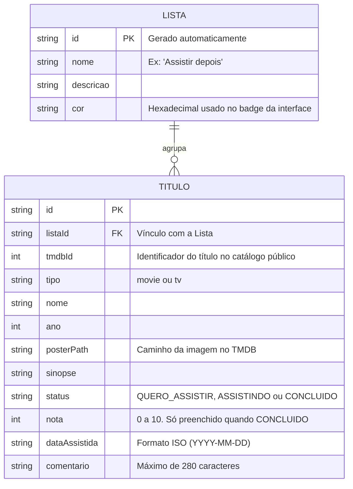

# 🛠️ Especificação Técnica (Tech Spec) - CineSI

**Autor:** Douglas Henrick

Este documento detalha a arquitetura técnica, o modelo de dados e os contratos de API (via JSON Server) necessários para o funcionamento do catálogo de filmes e séries CineSI.

## 1. Modelo de Dados (Diagrama ER)

Abaixo está o Diagrama Entidade-Relacionamento (DER) que representa a estrutura do nosso "banco de dados" (`db.json`) e como as informações se conectam.



## 2. Dicionário de Dados

Breve explicação das tabelas principais:

- **Listas:** Responsável por agrupar os títulos em contextos definidos pelo usuário. Funciona como a pasta onde cada filme ou série é guardado.
  - id: Identificador único gerado pelo JSON Server.
  - nome: Rótulo da lista. Não há trava de unicidade no banco, apenas validação no front-end.
  - cor: Valor hexadecimal usado para colorir o badge da lista na interface, reforçando a identidade visual definida no Design System.
- **Títulos:** Registra a coleção pessoal do usuário. Regra de Negócio Crítica: o registro **não duplica o catálogo público**. Ele guarda apenas o `tmdbId` mais os dados que pertencem ao usuário (status, nota, data e comentário). Os dados descritivos vindos da API são copiados na inclusão para que a listagem funcione sem depender de uma nova requisição a cada carregamento.
  - listaId: Chave estrangeira que vincula o título à lista (padrão de nomenclatura exigido pelo JSON Server para rotas aninhadas).
  - tmdbId: Identificador do título no catálogo público. Serve como chave natural de unicidade — o front-end impede que o mesmo título seja salvo duas vezes.
  - status: Aceita apenas os valores "QUERO_ASSISTIR", "ASSISTINDO" ou "CONCLUIDO".
  - nota: Número inteiro de 0 a 10. Só é aceito quando o status for "CONCLUIDO", já que não se avalia o que ainda não foi assistido.
  - dataAssistida: Obrigatória quando o status for "CONCLUIDO". O front-end bloqueia datas futuras.

## 3. Rotas da API (JSON Server)

A aplicação consome a API local simulada pelo JSON Server. Abaixo os principais endpoints:

- `GET /listas` - Retorna as listas do usuário.
- `POST /listas` - Cria uma nova lista.
- `DELETE /listas/:id` - Remove uma lista vazia.
- `GET /titulos` - Retorna a coleção completa.
- `GET /titulos?status=CONCLUIDO` - Filtra a coleção por status.
- `GET /titulos?listaId=1` - Retorna os títulos de uma lista específica.
- `POST /titulos` - Salva um novo título na coleção.
- `PATCH /titulos/:id` - Atualiza o status, a nota ou o comentário de um título.
- `DELETE /titulos/:id` - Remove um título da coleção.

## 4. Estrutura do Banco de Dados (db.json)

Esta é a representação em formato JSON do banco de dados simulado. Esta estrutura serve de contexto para ferramentas de IA e para o JSON Server inicializar a API Fake.

```json
{
    "listas": [
    {
        "id": "1",
        "nome": "Assistir depois",
        "descricao": "Fila principal",
        "cor": "#F5A524"
    }],
    "titulos": [
    {
        "id": "1",
        "listaId": "1",
        "tmdbId": 27205,
        "tipo": "movie",
        "nome": "A Origem",
        "ano": 2010,
        "posterPath": "/edv5CZvWj09upOsy2Y6IwDhK8bt.jpg",
        "sinopse": "Um ladrão que invade sonhos recebe uma tarefa inversa.",
        "status": "CONCLUIDO",
        "nota": 9,
        "dataAssistida": "2026-08-20",
        "comentario": "Segunda vez que assisto e ainda descubro coisa nova."
    },
    {
        "id": "2",
        "listaId": "1",
        "tmdbId": 1396,
        "tipo": "tv",
        "nome": "Breaking Bad",
        "ano": 2008,
        "posterPath": "/ggFHVNu6YYI5L9pCfOacjizRGt.jpg",
        "sinopse": "Um professor de química diagnosticado com câncer entra no crime.",
        "status": "ASSISTINDO",
        "nota": null,
        "dataAssistida": null,
        "comentario": null
    }]
}
```

## 5. API Pública (TMDB)

Além da API Fake, a aplicação consome a API pública do **TMDB (The Movie Database)** como fonte do catálogo de títulos.

- **Base da API:** `https://api.themoviedb.org/3`
- **Base das imagens:** `https://image.tmdb.org/t/p/{tamanho}{posterPath}`

Endpoints utilizados:

- `GET /search/multi?query={termo}&language=pt-BR` - Busca combinada de filmes e séries.
- `GET /movie/{id}?language=pt-BR` - Detalhes de um filme.
- `GET /tv/{id}?language=pt-BR` - Detalhes de uma série.
- `GET /trending/all/week?language=pt-BR` - Destaques exibidos na página inicial.

**Imagens responsivas:** o TMDB serve o mesmo pôster em várias larguras através do segmento de tamanho da URL (`w185`, `w342`, `w500`, `original`), o que permite carregamento adaptativo via `srcset` sem depender de um serviço externo de otimização.

**Limitação conhecida:** a API exige uma chave gratuita obtida por cadastro. Como a aplicação é estática e roda inteiramente no navegador, essa chave fica visível no código publicado. Evitar isso exigiria um backend intermediário, o que está fora do escopo da disciplina.
